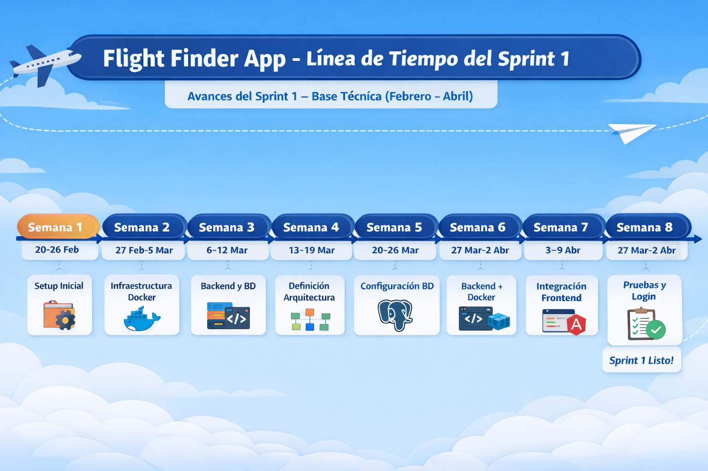

# 📋 Check-list de Avance del Proyecto – Flight Finder App  
## 📆 Semana 8 – Sprint 1 Base Técnica  

---

## 🧾 Información General

- **Proyecto:** Flight Finder App  
- **Asignatura:** Sistemas Distribuidos  
- **Sprint activo:** Sprint 1 – Base Técnica  
- **Duración del Sprint:** 20 de febrero – 2 de abril  
- **Semana evaluada:** Semana 8  
- **Estado del Sprint:** 🔄 En cierre  

---

## 🕒 Línea de Tiempo del Sprint 1

  

---

# ✅ Actividades Realizadas

Durante la semana 8 se llevó a cabo la fase de consolidación del sistema, enfocándose en estabilizar los componentes desarrollados, validar la integración entre servicios y preparar el cierre del Sprint 1.

---

## 🔐 1. Autenticación – HU-4

- Implementación del endpoint de registro de usuarios  
- Validaciones básicas de entrada (datos requeridos)  
- Persistencia en base de datos PostgreSQL  
- Pruebas iniciales desde backend (Spring Boot)  
- Consumo del servicio desde el frontend (Angular)  

---

## 🎨 2. Mejora UI/UX del Frontend

- Ajustes visuales en la pantalla de login  
- Implementación de fondo visual (imagen de contexto)  
- Mejora en la distribución de componentes  
- Preparación de componente informativo adicional (Flight Finder)  
- Optimización de experiencia de usuario (UX básica)  

---

## 🐳 3. Docker – Consolidación

- Ajustes finales en el archivo `docker-compose.yml`  
- Configuración de servicios:
  - Backend  
  - Base de datos PostgreSQL  
- Validación de ejecución de contenedores  
- Pruebas de conexión entre servicios en entorno Docker  
- Corrección de variables de entorno  

---

## 🧪 4. Pruebas del Sistema

- Pruebas de endpoints REST mediante herramientas (Postman)  
- Validación de flujo frontend → backend → base de datos  
- Identificación y corrección de errores de integración  
- Verificación de persistencia de datos  
- Validación de respuestas HTTP  

---

## 🔗 5. Integración General del Sistema

- Integración parcial de microservicios  
- Comunicación funcional entre frontend y backend  
- Validación de arquitectura definida en semanas anteriores  
- Consolidación de la estructura del proyecto  

---

# ❌ Actividades No Completadas

- Implementación de autenticación avanzada (JWT)  
- Seguridad robusta (roles, permisos, cifrado)  
- Integración completa de todos los microservicios  
- Despliegue en la nube  
- Orquestación con Kubernetes  

---

# 🔜 Próximas Actividades (Sprint 2)

- Implementar autenticación con JWT  
- Desarrollo del microservicio de búsqueda de vuelos  
- Integración completa de microservicios (login, users, search)  
- Implementación de API Gateway (opcional)  
- Despliegue en contenedores orquestados (Kubernetes)  
- Pruebas de carga y rendimiento  
- Mejora avanzada de UI/UX  

---

# 📊 Estado General del Proyecto

| Área | Estado |
|------|--------|
| Sprint 1 | 🔄 En cierre |
| Arquitectura | ✅ Definida |
| Backend | ✅ Funcional |
| Frontend | 🔄 En mejora |
| Base de datos | ✅ Operativa |
| Docker | 🔄 Estable |
| Integración | 🔄 Parcial |
| Seguridad | ⏳ Pendiente |

---

# 🧩 Conclusión

Durante la semana 8 el proyecto alcanzó un nivel funcional estable, permitiendo la interacción entre frontend, backend y base de datos dentro de un entorno contenerizado.

Se logró consolidar la arquitectura definida en el Sprint 1, dejando una base sólida para la evolución del sistema en el Sprint 2, donde se abordarán aspectos clave como la seguridad, la escalabilidad y la implementación completa de los microservicios restantes.